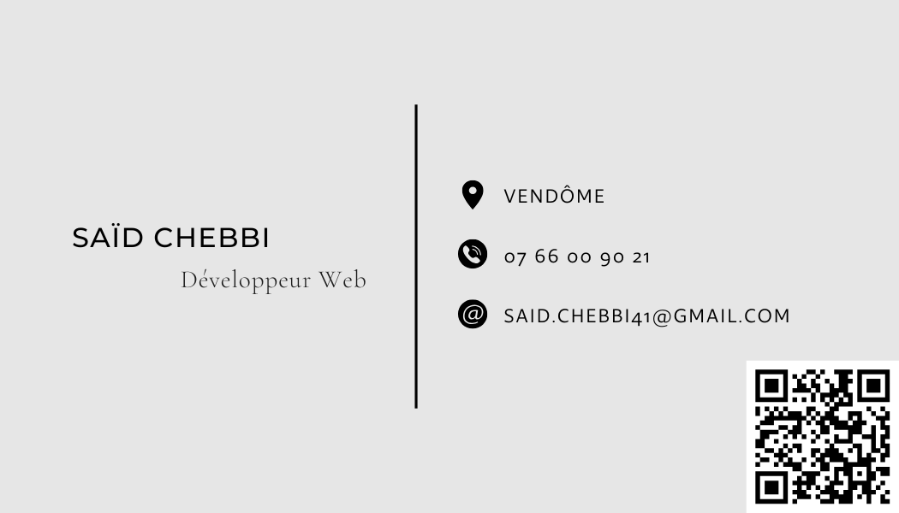

# Saïd CHEBBI

Fort d’un parcours riche en expériences variées, incluant la création de mon entreprise, j’ai
choisi de me réorienter vers le métier qui me passionne : le développement web.
Actuellement en formation dans ce domaine, je suis à la recherche d’un stage du 15/09 au
21/11 qui me permettra de mettre en pratique mes compétences et de valider mon bac+2

## 📄Projets :
<ul>
<li>

[Curriculum Vitae](https://chebbis.github.io/CV/)
</li>
<li>
Projet à venir
</li>
</ul>

## 🛠️Compétences :

## 🔗Liens :

# Tristan Martin

Je m'appelle **Tristan Martin** et je suis actuellement en reconversion professionnelle. Passionné par l'informatique et les nouvelles technologies, je suis motivé à apprendre et à évoluer dans le domaine du développement.

## 📄 Projets

- Réalisation d’un **CV professionnel** : [lien](https://trqr.github.io/CVFormation/).
- Création site e-commerce [Crafty Store](https://trqr.github.io/CVFormation/).

## 🛠️ Compétences

## 🔗 Liens

# Killian Bastard-Lahoreau

Je suis actuellement en reconversion depuis mars 2025 afin de devenir développeur web.
## 📄Projets :
<a href="../CVhtml/Index.html">Mon cv version html</a>

## 🛠️Compétences :

## 🔗Liens : 

# Alexis Moreau

 

Je m'appelle Alexis Moreau, j'ai 33 ans et je vis à Tours (37)

Je suis passionné par le domaine du numérique et je suis en train de suivre une formation de développeur web et web mobile au GRETA Centre Val De Loire pour obtenir un titre professionnel Bac +2.

Je suis déterminé et motivé à mettre en pratique mes connaissances dans un cadre professionnel.

En raison de mon intérêt pour les langages de programmation, je suis constamment motivé à apprendre et à m'impliquer dans des projets visant à développer mes compétences.

## 📄Projets :

<ul>
	<li><a href="https://alexis-moreau.fr/Index.html" target="_blank">Projet site CV</a></li>
	<li>Projet à venir</li>
</ul>

## 🛠️Compérences :

## 🔗Liens :

