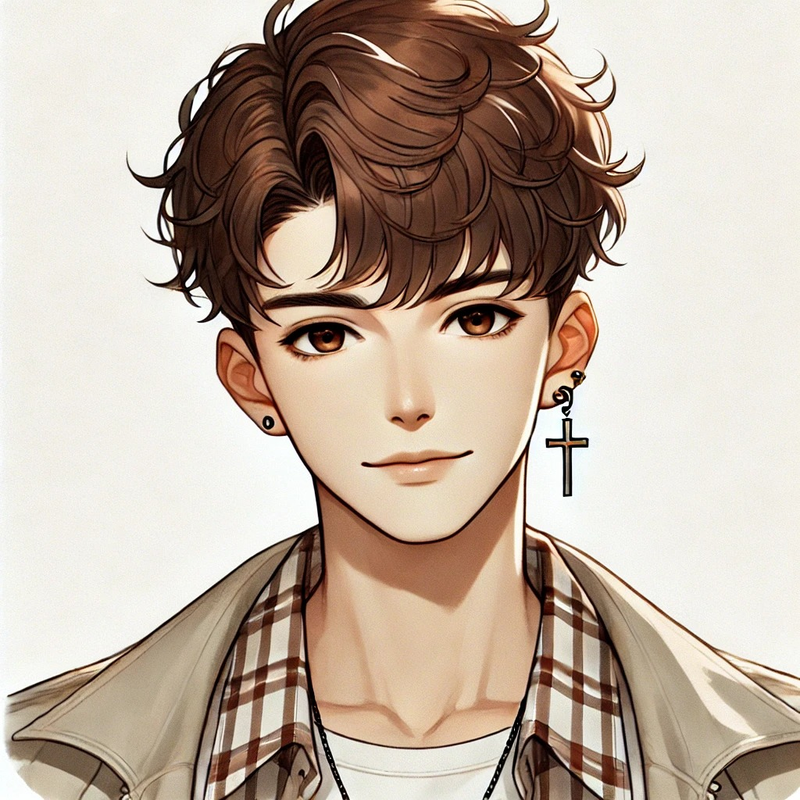
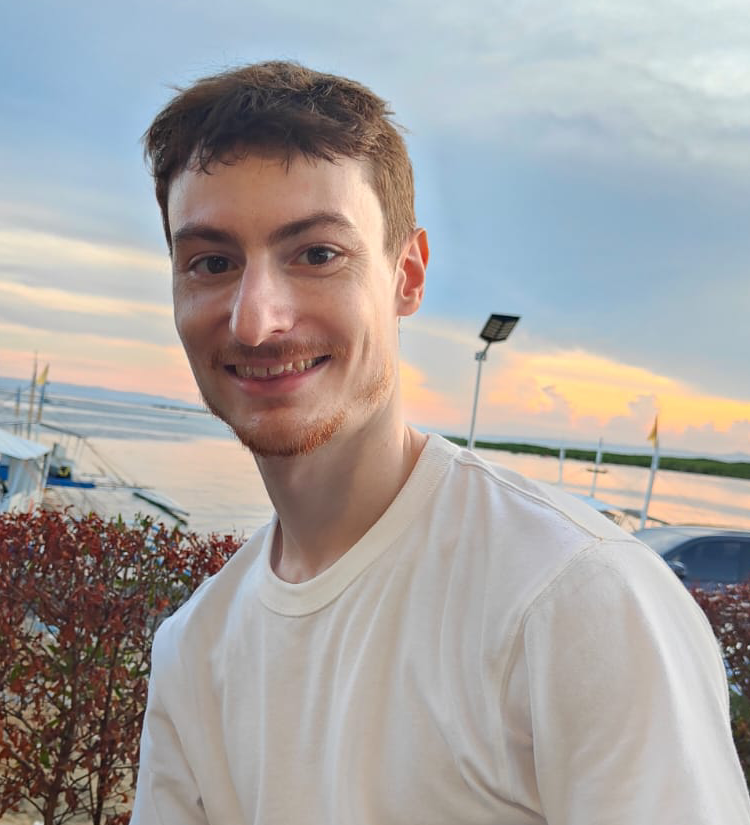

# Formation Développpeur Web et Web Mobile du 25 mars 2025 au 15 janvier 2026

## Yusuf Karaca 

*Je suis Yusuf Karaca, 24 ans, futur développeur web et web mobile certifié par le GRETA Centre Val de Loire.*

## 📄 Projets :
*Projets à venir.*

## 🛠️ Compétences :

## 🔗 Liens

*Veuillez trouver ci-joint les informations sur mon LinkedIn, mon CV ainsi que mon GitHub :* 

# LAHDAR Yousra

  
Je suis actuellement en reconversion depuis mars 2025 afin de devenir développeur web.
## 📄Projets :
<a href="../../Documents/ cv-yousra/cv1.html">Mon cv version html</a>

## 🛠️Compétences :

## 🔗Liens : 

# Killian Bastard-Lahoreau

# Alexandre DELSOL

Je suis passionné de develppement web. Je suis motivé à coder.
## 📄Projets :
<a href="https://alexandredelsol.github.io/">Mon cv version html</a>

## 🛠️Compétences :

## 🔗Liens :

# Alexis Moreau

 

Je m'appelle Alexis Moreau, j'ai 33 ans et je vis à Tours (37)

Je suis passionné par le domaine du numérique et je suis en train de suivre une formation de développeur web et web mobile au GRETA Centre Val De Loire pour obtenir un titre professionnel Bac +2.

## 📄Projets :

<ul>
	<li><a href="https://alexis-moreau.fr/Index.html" target="_blank">Projet site CV</a></li>
	<li>Projet à venir</li>
</ul>

## 🛠️Compérences :

## 🔗Liens :

<a href="/profile/CVAlexis_MoreauV3.1.pdf"></a
