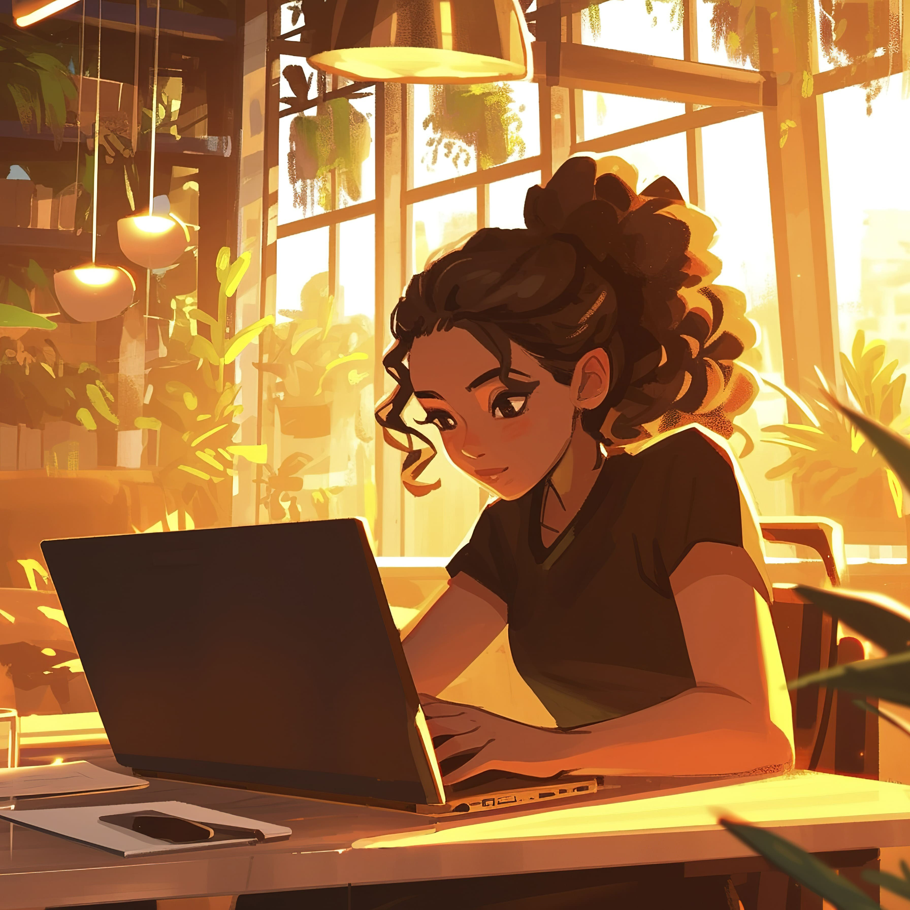
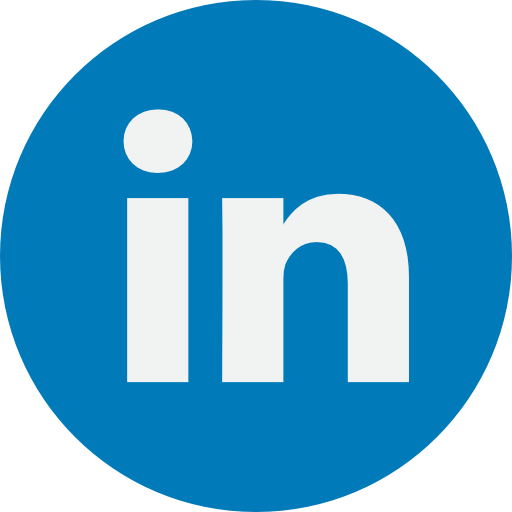
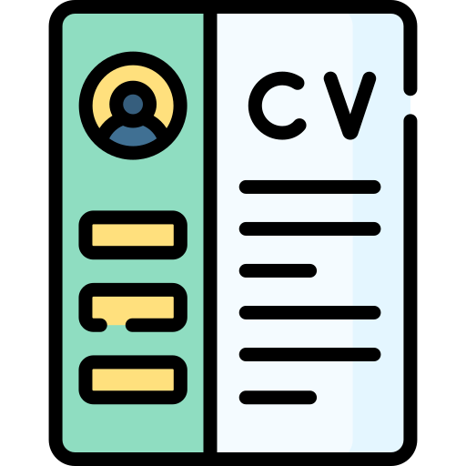

👋 Bonjour ! Je m'appelle Mariam Nzeyimana.  
Passionnée par la technologie et le développement web, je suis en pleine reconversion professionnelle pour devenir Développeuse Web.

## 📄 Projets :

<ul>
	<li><a href="https://mariamnze.github.io/cv/">Mon CV  Numérique</a></li>
	<li><a href="https://www.figma.com/design/cd1S2Q8Dz5ioOGL3g18J1g/Pizza?node-id=0-1&t=06A0XhI3ozCO0ncL-1">Figma - Application pour commander des pizzas</a></li>
</ul>

## 🛠️ Compétences :

## 🔗 Liens :

