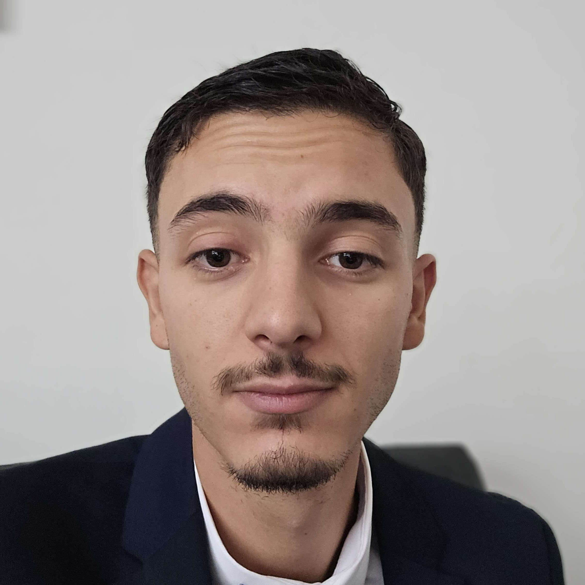

# Saïd CHEBBI

Fort d’un parcours riche en expériences variées, incluant la création de mon entreprise, j’ai
choisi de me réorienter vers le métier qui me passionne : le développement web.
Actuellement en formation dans ce domaine, je suis à la recherche d’un stage du 15/09 au
21/11 qui me permettra de mettre en pratique mes compétences et de valider mon bac+2

## 📄Projets :
<ul>
<li>

[Curriculum Vitae](https://chebbis.github.io/CV/)
</li>
<li>
Projet à venir
</li>
</ul>

## 🛠️Compétences :

## 🔗Liens :

